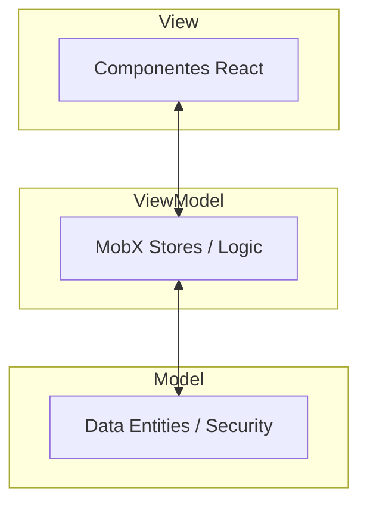

# Plataforma Íris 🌸


Uma plataforma digital dedicada ao bem-estar mental, construída sobre os pilares de **Empatia, Segurança, Anonimato e Escalabilidade**. A Íris oferece um refúgio digital onde o autoconhecimento e o suporte emocional caminham juntos com a privacidade absoluta.

---

## ✨ Funcionalidades Principais

### 👤 Identidade Anônima
Geração dinâmica de perfis únicos (ex: *SereneEagle223*) para garantir que você possa se expressar sem medo de julgamentos ou exposição.

### 📝 Check-in Emocional Criptografado
Um diário interativo com seletor de humor visual e notas protegidas por **AES-GCM (Web Crypto API)**, garantindo que suas reflexões sejam apenas suas.

### 📊 Dashboard de Insights & Evolução
Visualização dinâmica do seu progresso através de gráficos de tendência de humor animados, ajudando a identificar padrões emocionais ao longo do tempo.

### 💬 Suporte Íris
Um assistente de conversação empático e inteligente, projetado para ouvir, validar e apoiar você em momentos de necessidade, com total anonimato.

### 🏘️ Comunidade "Vozes Íris"
Espaço seguro para compartilhar experiências de forma anônima com outros membros da rede, monitorado por sistemas de proteção à vida.

### 🔐 Cofre de Memórias
Área de segurança máxima protegida por criptografia local de grau militar, ideal para guardar pensamentos íntimos com segurança absoluta.

---

## 🏗️ Arquitetura e Tecnologias

O projeto utiliza o padrão **MVVM Modular** para garantir uma separação clara de responsabilidades, alta testabilidade e performance fluida.



### Stack Tecnológica:
- **Frontend**: React 19 + Vite
- **Linguagem**: TypeScript (Strict Mode)
- **Estado**: MobX (ViewModel Reativo)
- **Animações**: Framer Motion (Micro-interações)
- **Segurança**: Web Crypto API (AES-GCM 256-bit + PBKDF2)
- **Mobile**: Suporte a **PWA** (Instalável e Offline)

---

## 🎨 Design System

A interface foi projetada para ser **Clean, Acolhedora e Intuitiva**:
- **Cores**: Paleta baseada em tons pastéis e branco puro para reduzir o estresse visual.
- **Tipografia**: `Plus Jakarta Sans` para corpo e `Outfit` para títulos, garantindo legibilidade premium.
- **Efeitos**: Glassmorphism suave e transições animadas para uma experiência viva.

---

## 🚀 Como Executar

### Pré-requisitos
- Node.js (v18+)
- NPM ou Yarn

### Instalação e Execução

1. **Instalar dependências:**
   ```bash
   npm install
   ```

2. **Rodar em desenvolvimento:**
   ```bash
   npm run dev
   ```

3. **Acessar Storybook (Design System):**
   ```bash
   npm run storybook
   ```

---

## 🔒 Compromisso com a Privacidade

A Íris adota o princípio de **Criptografia na Origem (Zero-Trust)**. Suas notas e conversas são cifradas no seu dispositivo antes mesmo de serem armazenadas. Você detém as chaves; você detém suas memórias. A tecnologia trabalha para proteger sua mente.

---
<p align="center">
  <b>Finalizado com sucesso.</b><br>
  Desenvolvido com carinho para promover a saúde mental no mundo digital.
</p>
