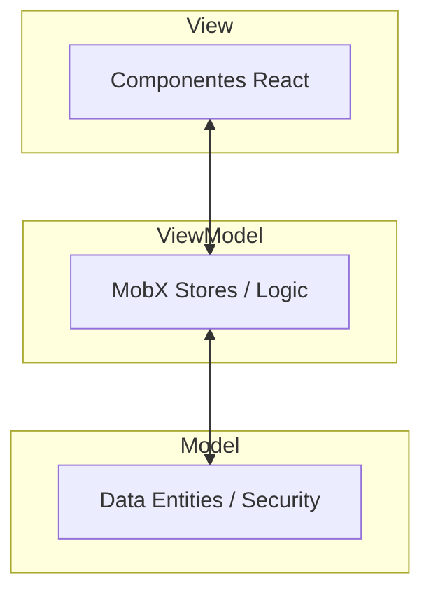

# Plataforma Íris 🌸


Uma plataforma digital dedicada ao bem-estar mental, construída sobre os pilares de **Empatia, Segurança, Anonimato e Escalabilidade**. A Íris oferece um refúgio digital onde o autoconhecimento e o suporte emocional caminham juntos com a privacidade absoluta.

---

## ✨ Funcionalidades

### 👤 Identidade Anônima
Geração dinâmica de perfis únicos (ex: *SereneEagle223*) para garantir que você possa se expressar sem medo de julgamentos ou exposição.

### 📝 Check-in Emocional
Um diário interativo com seletor de humor visual e notas criptografadas para acompanhar sua jornada interior dia após dia.

### 📊 Dashboard de Insights
Visualização clara do seu progresso, tendências de humor e dicas personalizadas para promover o equilíbrio emocional.

### 💬 Suporte Íris
Um assistente de conversação empático, projetado para ouvir, validar e apoiar você em momentos de necessidade, com total anonimato.

### 🏘️ Comunidade "Vozes Íris"
Espaço seguro para compartilhar experiências de forma anônima com outros membros da rede, monitorado por sistemas de proteção à vida.

### 🔐 Cofre de Memórias
Área de segurança máxima protegida por criptografia AES-256 local, ideal para guardar pensamentos que devem permanecer apenas seus.

---

## 🏗️ Arquitetura e Tecnologias

O projeto utiliza o padrão **MVVM Modular** para garantir uma separação clara de responsabilidades e alta testabilidade.



### Stack Tecnológica:
- **Frontend**: React 19 + Vite
- **Linguagem**: TypeScript (Strict Mode)
- **Estado**: MobX & MobX React Lite
- **Animações**: Framer Motion
- **Ícones**: Lucide React
- **Segurança**: Web Crypto API (Client-side Encryption)

---

## 🎨 Design System

A interface foi projetada para ser **Clean, Acolhedora e Intuitiva**:
- **Cores**: Paleta baseada em tons pastéis e branco puro para reduzir o estresse visual.
- **Tipografia**: `Plus Jakarta Sans` para corpo e `Outfit` para títulos, garantindo legibilidade premium.
- **Efeitos**: Glassmorphism suave e micro-interações fluidas para uma sensação de modernidade.

---

## 🚀 Começando

### Pré-requisitos
- Node.js (v18+)
- NPM ou Yarn

### Instalação e Execução

1. **Instalar dependências:**
   ```bash
   npm install
   ```

2. **Rodar em desenvolvimento:**
   ```bash
   npm run dev
   ```

3. **Acessar Storybook (Design System):**
   ```bash
   npm run storybook
   ```

---

## 🔒 Compromisso com a Privacidade

Diferente de outras plataformas, a Íris adota o princípio de **Criptografia na Origem**. Isso significa que suas notas e conversas são cifradas no seu dispositivo antes mesmo de serem armazenadas. Você detém as chaves; você detém suas memórias.


---
<p align="center">
  Desenvolvido com carinho para promover a saúde mental no mundo digital.
</p>
